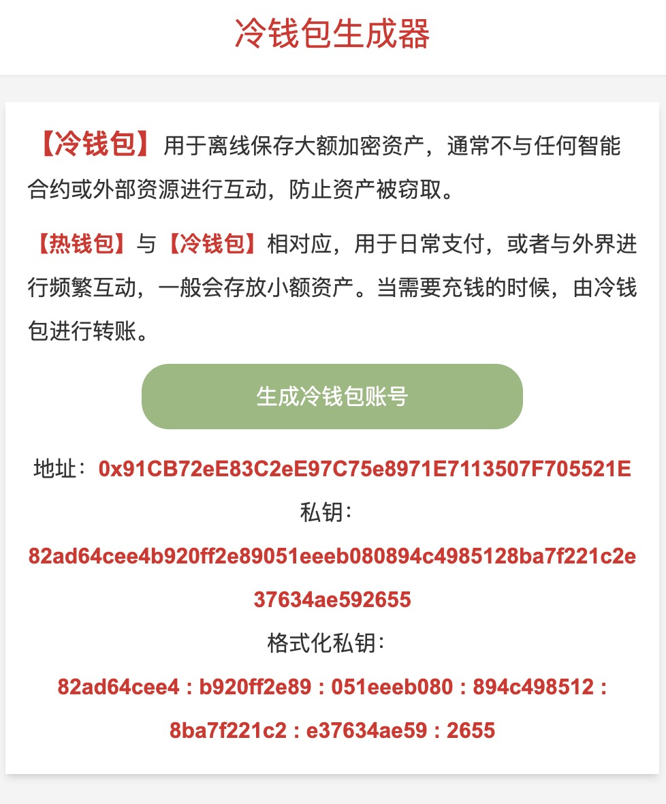

# 冷钱包生成器

DApp 演示网站：[https://binschool.app/coldwallet](https://binschool.app/coldwallet)。

DApp 截图：

  


## 项目介绍

【冷钱包】用于离线保存大额加密资产，通常不与任何智能合约或外部资源进行互动，防止资产被窃取。

【热钱包】与【冷钱包】相对应，用于日常支付，或者与外界进行频繁互动，一般会存放小额资产。当需要充钱的时候，由冷钱包进行转账。

## 编译部署

本项目只有前端，无需后端和链端。

前端使用 vscode 编写，下载项目后，需要首先安装依赖包：

```bash
npm install
```

运行：

```bash
npm run start
```

编译：

```bash
npm run build
```

## 部署

编译后的文件位于 dist 目录中。

- 将 dist/server/pages/ 的文件，放置在 nginx root 目录下。

- 将 dist/static/ 下的文件，放置在 nginx root 目录下的 /_next/static/ 目录下。

- 将 public/images/ 下的文件，放置在 nginx root 目录下的 /images/ 目录下。


### 联系方式
微信：bkra50  Twitter: [BinSchoolApp](https://twitter.com/BinSchoolApp)