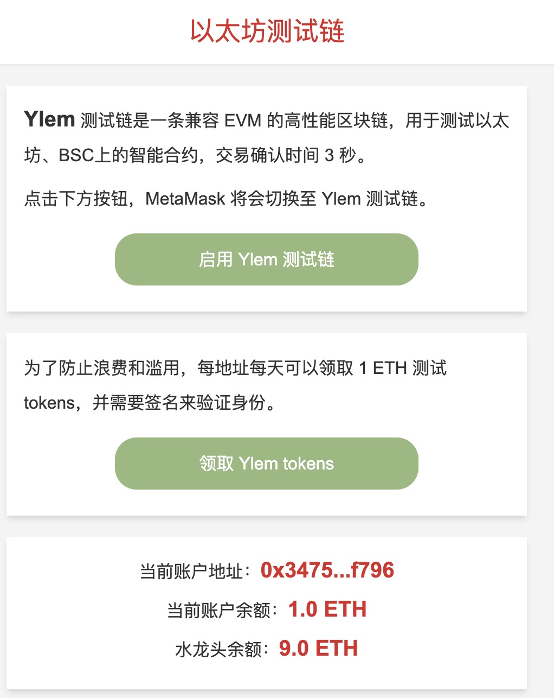

# 以太坊测试链水龙头

DApp 截图：

  

DApp 地址：

[https://faucet.binlabs.app](https://faucet.binlabs.app)

## 项目介绍

前端使用 Next.js 框架开发。

后端使用 go 语言开发，源码位于 backend 目录。

链端合约使用了 EIP712 标准，实现链下签名、链上验证功能，防止恶意领取，源码位于 contract 目录。

合约已经部署在 Ylem 测试链上，地址为：0x3e70c24D98c8FEa3b2c3Adb799075df09f6dE050。

Ylem 测试链是一条兼容 EVM 的高性能区块链，用于测试以太坊、BSC上的智能合约，交易确认时间 3 秒。

Ylem 测试链由南京百市通公司提供，仅用于 Web3 学习。

## 编译运行

本项目前端使用 vscode 编写，下载项目后，需要首先安装依赖包。

### 安装

```bash
npm install
```

### 运行

```bash
npm run start
```

运行后，可以在浏览器中查看效果，默认链接为：[http://localhost:3000](http://localhost:3000)

### 编译

```bash
npm run build
```

### 部署

编译后的文件位于 dist 目录中。

- 将 dist/server/pages/ 的文件，放置在 nginx root 目录下。

- 将 dist/static/ 下的文件，放置在 nginx root 目录下的 /_next/static/ 目录下。

- 将 public/images/ 下的文件，放置在 nginx root 目录下的 /images/ 目录下。


## 联系方式
微信：bkra50  Twitter: [BinSchoolApp](https://twitter.com/BinSchoolApp)


