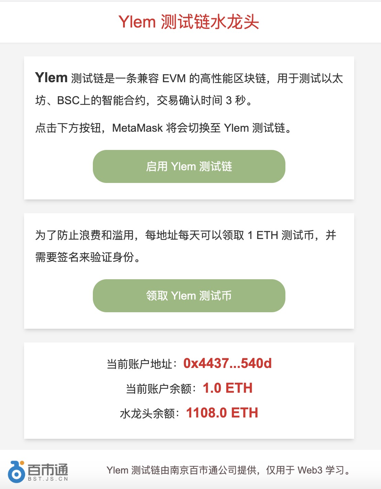

# Ylem 测试链水龙头

DApp 演示网站：[https://faucet.binschool.app](https://faucet.binschool.app)。

DApp 截图：

  


## 项目介绍
Ylem 测试链是一条兼容 EVM 的高性能区块链，用于测试以太坊、BSC上的智能合约，交易确认时间 3 秒。

项目前端使用 Next.js 框架和 Tailwind CSS 开发。

项目后端使用 golang 编写，位于 backend 目录，它只有一个文件，提供了一个 api，用于把用户提交的签名数据，转给链端的智能合约。

项目链端是一个是使用 solidity 编写的智能合约，用于申领测试币。

## 编译运行
链端智能合约使用 Remix 编译部署。

后端使用 goland 编译，配合 nginx，提供 api 服务。

前端使用 vscode 编写，下载项目后，需要首先安装依赖包。

### 安装

```bash
npm install
```

### 运行

```bash
npm run start
```

运行后，可以在浏览器中查看效果，默认链接为：[http://localhost:3000](http://localhost:3000)

### 编译

```bash
npm run build
```

### 部署

编译后的文件位于 dist 目录中。

- 将 dist/server/pages/ 的文件，放置在 nginx root 目录下。

- 将 dist/static/ 下的文件，放置在 nginx root 目录下的 /_next/static/ 目录下。

- 将 public/images/ 下的文件，放置在 nginx root 目录下的 /images/ 目录下。


## 联系方式
微信：bkra50  Twitter: [BinSchoolApp](https://twitter.com/BinSchoolApp)

