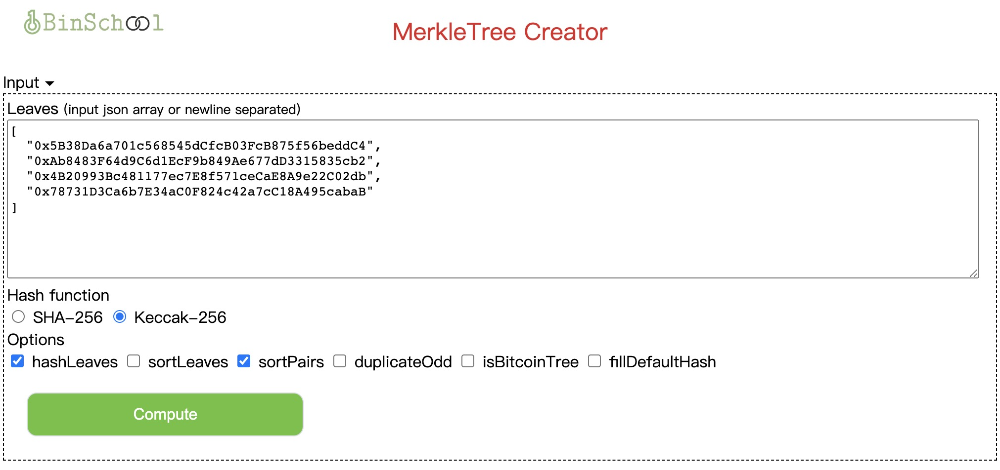

# 默克尔树生成器 merkle tree creator

DApp 截图：

  

DApp 地址：

[https://binschool.app/tool/merkle](https://binschool.app/tool/merkle)

## 项目介绍

默克尔树生成器是一个纯 js 和 html 文件，没有使用任何框架。

它使用了开源的 merkletree.js 项目。

本项目可用于制作 merkle tree 的根哈希值和验证路径。

可用于 NFT 空投或者优先铸造的白名单资格验证。

相关的使用场景可以参考 [binschool.app](https://binschool.app) 常用合约中默克尔树部分。

这是一个纯绿色项目，无需安装任何框架，直接作为静态文件放到 web server 中即可。

## 联系方式
微信：bkra50  Twitter: [BinSchoolApp](https://twitter.com/BinSchoolApp)

